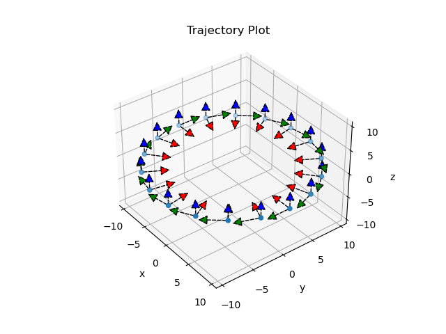

Trajectory Visualization
========================

The `viz_trajectory.py <../../../trajectory_visualization/viz_trajectory.py>`_ script is used for
visualization of poses from a text file in the format 'ts px py pz qx qy qz qw' where *ts* is the
timestamp in ns and *(px py pz)* is the translation and *(qx qy qz qw)* is the rotation in quaternion in
the **quaternion last** format. The script is used for debugging the output poses saved from the marginalization queue of Basalt.
It helps to check if the source and destination frame of the poses is correct i.e. camera to world
(z-axis should point forward, i.e. in the direction of motion of the camera).  

Running the script:

.. code-block:: text

    usage: viz_trajectory.py [-h] trajectory_path

    Python code for visualization of poses obtained from basalt.

    positional arguments:
      trajectory_path  path to .txt file containing poses from basalt

    optional arguments:
      -h, --help       show this help message and exit

    E.g.
    python3 viz_trajectory.py ./trajectories.txt

The `trajectories.txt <../../../trajectory_visualization/trajectories.txt>`_ file has been generated to check the script.
The poses are generated such that the camera moves in a circle in a plane always facing the center. (shown below)

Another demo image of the poses of the hka-outdoors-1 sequence visualized:

.. image:: ../../../trajectory_visualization/demo2.png

--------------------------------------------

`quiver3d_demo.py <../../../trajectory_visualization/quiver3d_demo.py>`_ is just a demo script for
visualizing the arrow object in a matplotlib window. [`ref <https://gist.github.com/WetHat/1d6cd0f7309535311a539b42cccca89c>`_]